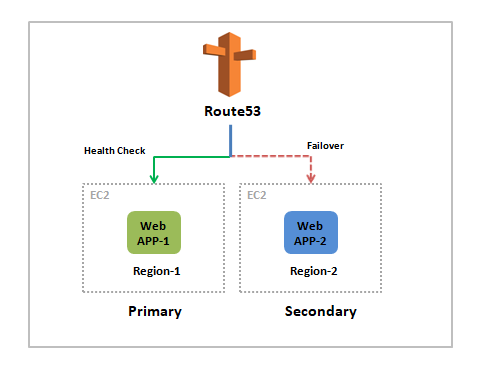

# Route-53
# Handling Multi-Region fail-over with Amazon Route 53
Availability of an AWS region can be disrupted due any region wide events such as natural disasters, un-planned service outages etc.

The disruption in the availability of a region can be of an extended length of time which makes cross-region replication and availability an important aspect of your architecture. This will ensure that applications are highly available.

Amazon Route53 ensures that your applications are available with minimal amount of downtime.

Let us see how we configure disaster recovery scenario using route53.

# Step 1: Check your applications running in two regions

* Created 2 EC2 instance in 2 different region and install nginx server on both make sure then are up and running fine.
 * 1st EC2 instance web1 launched in N.virginia region

output:

* 2nd EC2 instance web2 launched in mumbai region

output:

# Step 2: Configuring a Health Check

* Let us create a health check that will check the heath of out primary web server.
* AWS has health checkers located in multiple locations around the world that can test whether your website is accessible.
* Go to Route 53 from AWS services
* In the navigation pane, click Health checks then Click Create health check.
* In the Configure health check page, configure the following settings like Name of the health check as “check-1“,IP address of primary webserver you copied earlier
* In the advanced Confgurations, give Request Interval as Fast (10 seconds), and Failure threshold as 2

* Then click on – Create Health Check

# Step 3: Configure your Domain in Route53
Let us configure our domain to point to our primary and secondary web servers.

* Firstly create a domain if it is already not their for your app
* Click the name of your domain.
* Click Create Record Set.
* We will now create a DNS A-record to point to your Primary web server.
* An A-record resolves a domain name by returning an IP address.
* We will also associate this Record Set with the Health Check wecreated earlier so that traffic will only be sent to your Primary web server if the Health Check indicates that the server is healthy.
* In Create Record Set, configure the following settings as shown in below image: Name as www, TTL a 60 seconds , Value as Primary Web Server IP v4 address, Associate With Health Check as Yes
* Failover Record Type as primary, give name of the health check as check-1 which you created earlier.

* Then click on Create !
* An A-record should be listed. If the newly created record does not immediately appear in the table, periodically 
click the refresh icon to update the table until it appears.

Now Let us create another Record Set for fail-over!

* Click Create Record Set again for secondary web server
* In Create Record Set, configure the following settings as shown as above: Name as www, TTL a 60 seconds , Value as Secondary Web Server IP v4 address, Associate With Health Check as NO

* Click Create
* You are not associating this record with a Health Check because there is no third site available.
* You can now check the status of your Health Check.
* In the navigation pane, click Health checks.
* Select check-1.
* Click the Health checkers tab at the bottom of the page.
* The health check is performed independently from multiple locations around the world, with each location requesting the page every 10 seconds.
* Confirm that check-1 has a status of Healthy.

You have now configured your web application to fail-over across two regions.

# Additional step
Configure ip address with domain name to test the changes more effectively.

* Login with respective domain provider website I used godaddy website configured with cloudflare.
* open cloudflare domain DNS setting add both instance ip address in A records.

* If you doesn't follow this step check the status with instance IP address only.

# Step 4: Check the DNS Resolution
Let us query DNS (Domain Name Service) to verify that Amazon Route 53 is correctly sending traffic to your Primary web server.

* In the navigation pane, click Hosted zones.
* Click the name of your domain
* Click Test Record Set.
* If the Test Record Set button is not visible, try making your window wider so that it appears.
* In Check response from Route 53, configure the following settings as shown in below two pics:

* Click Get response.
* The DNS response will bow be tested, with the results appearing on the right side of the window.
* Look at the Response returned by Route 53 value. Confirm that it is the same IP address as your Primary web server.
* If correct IP address is not displayed, check the configuration again
* The fact that the Domain resolved to the IP address of the Primary web server means that requests to your domain will be routed by default to that web server.

output with domain name.

# Step 5: Test the fail-over
Finally, let us verify that Amazon Route 53 correctly fails over to your Secondary web server if your Primary web server fails.
We will simulate a failure by manually stopping the instance in your primary region as shown in below image

* Go to EC2 > Instances and stop the primary web server which is in us-east-1 and wait until the instance state changes to stopped.
* Now go to Route 53.
* Click Health checks.
* Select check-1 and click the Health checkers tab
* Wait until the status of check-1 is Unhealthy. If necessary, periodically click the refresh icon in the top-right corner.

* The Health Check has now detected that your Primary web server has stopped responding.
* It should now be directing DNS requests to the Secondary web server.

Test the fail-over

* In the navigation pane, click Hosted zones.
* Click your domain name.
* In Check response from Route 53, configure the following settings as shown in image
* Click on Get Response and you can see Response returned by Route53 which is now pointing to secondary web server

output with domain name.

Done
Happy Learning!!!!!!!!!!!!!!!!!!